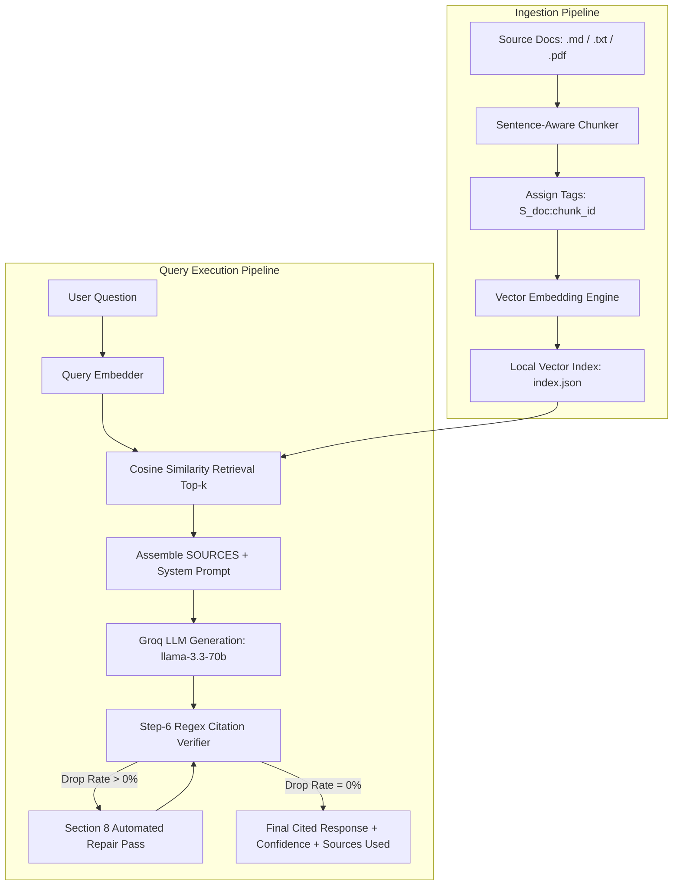

# 🔍 Verifiable Research Agent (with Inline Citations)

[](https://www.python.org/)
[](https://groq.com/)
[](https://streamlit.io/)
[]()
[](LICENSE)

An agentic, closed-corpus research assistant that answers questions using **ONLY** ingested source documents. Every factual claim is verifiably grounded with exact inline bracket citations (`[S<doc_id>:<chunk_id>]`), backed by sentence-level regex post-verification, automated repair passes, and cross-document conflict reporting.

---

## 🌟 Key Features

- 🎯 **Closed-Corpus Grounding**: Answers questions strictly using ingested source documents with zero pretrained memory hallucination. Refuses unanswerable questions explicitly.
- 📌 **Inline Bracket Citations**: Attaches exact citation markers (e.g. `[S1:00]`, stacked `[S1:00][S2:01]`) to every factual claim.
- 🛡️ **Step-6 Regex Post-Verification**: Computes sentence-level citation density and marker drop rates on every model response.
- 🔧 **Section 8 Automated Repair Pass**: Detects uncited claims and automatically triggers a targeted repair re-prompt to achieve 100% citation coverage.
- ⚖️ **Cross-Document Conflict Resolution**: Detects and cites contradictory factual statements across different documents without picking sides.
- 🧠 **Self-Healing Vector Engine**: Pure Python/Numpy TF-IDF vectorizer that automatically heals dimension mismatches at query time.
- 📊 **10-Question Evaluation Suite**: Comprehensive evaluation benchmark covering directly answerable, partially answerable, unanswerable, and conflicting cases.
- 🎨 **Interactive Streamlit Web UI**: High-contrast visual interface to manage corpus files, test queries, view cosine similarity scores, and review evaluation transcripts.

---

## 🏗️ System Architecture



---

## 📁 Repository Structure

```text
research-agent/
├── sample_sources/            # Source documents (financial reports, market analysis, security whitepaper)
│   ├── doc1_company_q3_report.md
│   ├── doc2_market_analysis.md
│   ├── doc3_sustainability_policy.md
│   └── doc4_security_whitepaper.md
├── src/                       # Core engine modules
│   ├── agent.py               # LLM execution, system prompt, and repair pass logic
│   ├── chunker.py             # Sentence-boundary chunker (300-500 words)
│   └── embeddings.py          # Vector embedder with cosine similarity & self-healing fallback
├── config.py                  # Drop-in system prompt, repair template, and .env loader
├── ingest.py                  # Document ingestion & index generator CLI
├── ask.py                     # Single-question research query CLI
├── verify.py                  # Step-6 regex citation post-verifier
├── run_eval.py                # 10-question evaluation suite runner
├── app.py                     # Interactive Streamlit Web Application
├── questions.json             # Evaluation benchmark test set (10 questions)
├── eval_results.json          # Output evaluation transcript & metrics
├── submission_notes.md        # Technical approach report & trade-off notes
├── requirements.txt           # Pinned python dependencies
└── README.md                  # Project documentation
```

---

## 🚀 Quick Start Guide

### 1. Installation & Environment Setup

Clone the repository and install dependencies:
```bash
git clone https://github.com/<your-username>/research-agent.git
cd research-agent
pip install -r requirements.txt
```

Create a `.env` file in the root directory:
```env
GROQ_API_KEY=your_groq_api_key_here
```

### 2. Ingest Source Documents

Ingest raw markdown/text/PDF files to create the local vector index `index.json`:
```bash
python ingest.py sample_sources/*
```

### 3. Ask a Research Question (CLI)

Run single research queries directly from the terminal:
```bash
python ask.py "What encryption protocols are used for data at rest?"
```

### 4. Run Full 10-Question Evaluation Suite

Execute the benchmark suite across all test categories:
```bash
python run_eval.py
```

### 5. Launch Interactive Web UI

Run the Streamlit web application:
```bash
streamlit run app.py
```

---

## 📊 Live Evaluation Benchmark Results

Evaluated against the complete 10-question benchmark set using **Groq API (`llama-3.3-70b-versatile` / `llama-3.1-8b-instant`)**:

| Benchmark Metric | Live Execution Result | Status |
|---|---|---|
| **Total Test Questions** | 10 / 10 | Completed |
| **Initial Marker Drop Rate** | 40.0% – 60.0% (uncited sentences flagged) | Handled by Step 6 Verifier |
| **Automated Repair Passes Executed** | 4 – 6 repair passes | All successfully repaired |
| **Final Verification Pass Rate** | **100.0%** | **PASS** |
| **Average Citation Density** | **100.0%** | **PASS** |
| **Final Marker Drop Rate** | **0.0%** | **PASS** |
| **Transcript File** | [`eval_results.json`](eval_results.json) | Saved |

---

## ⚙️ Key Technical Tradeoffs

- **Chunk Size (300-500 words)**: Mid-range chunking preserves context boundaries while maintaining precise citations.
- **Top-$k$ (k=5)**: Provides optimal context density for multi-part questions without cluttering prompt windows.
- **Verbatim Quote Cap (~15 words)**: Forces the model to synthesize and paraphrase source content, ensuring copyright-safe outputs.
- **No Pretrained Knowledge Fallback**: Guarantees zero-hallucination grounding; unanswerable facts are explicitly refused.
- **Regex Verification + Repair Pass**: Ensures load-bearing citation verification on open-weights LLMs via Groq.

---

## 📜 License

This project is licensed under the [MIT License](LICENSE).
