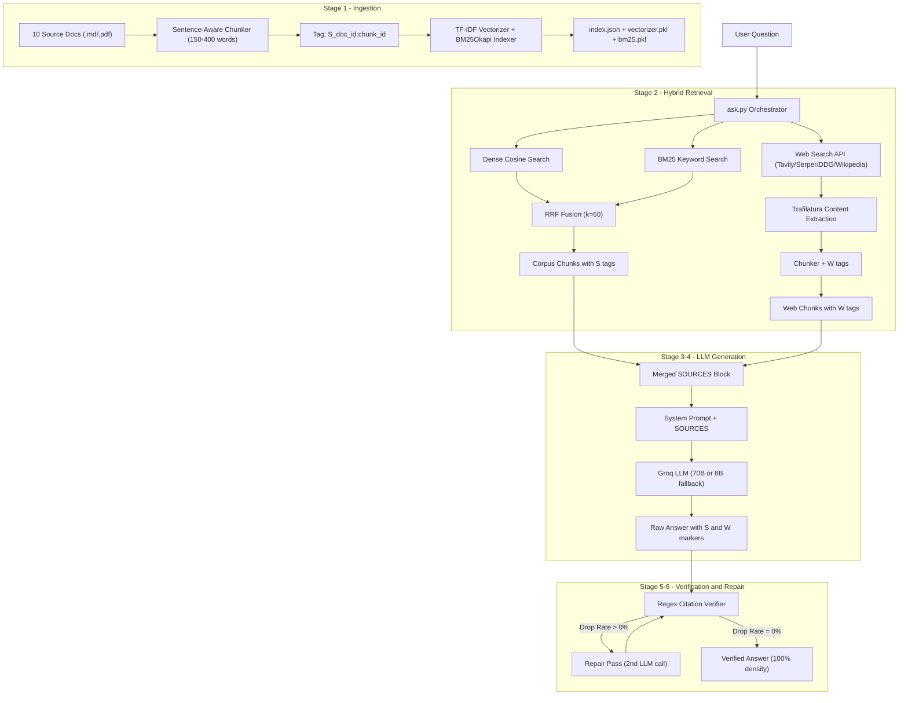

# 🔍 Verifiable Research Agent

### Inline Citations · Hybrid RRF Retrieval · Live Web Search · Automated Repair

[](https://www.python.org/)
[](https://groq.com/)
[](https://streamlit.io/)
[]()
[]()
[](LICENSE)

An agentic RAG pipeline that answers complex research questions using closed-corpus documents and/or live web search. Every factual claim is verifiably grounded with exact inline bracket citations (`[S<doc_id>:<chunk_id>]` for corpus, `[W<result_id>:<chunk_id>]` for web), enforced by regex post-verification and an automated repair pass.

---

## Key Features

| Feature | Description |
|---------|-------------|
| **Closed-Corpus + Live Web** | `--source=corpus\|web\|both` — answers from local documents, live internet, or both combined |
| **Hybrid RRF Retrieval** | Dense cosine similarity + BM25 keyword search merged via Reciprocal Rank Fusion (k=60) |
| **Dual Citation Markers** | `[S1:00]` for corpus, `[W1:00]` for web — stacked `[S1:02][W2:01]` for multi-source claims |
| **Step-6 Regex Verification** | Every factual sentence scanned with `r'\[(S\|W)\d+:\d{2}(?::\d+)?\]'` |
| **Automated Repair Pass** | Uncited claims trigger a targeted re-prompt to maximize citation coverage |
| **Web Fetch Audit Log** | Every URL fetch logged to `web_fetch_log.jsonl` with timestamp, status, word count |
| **LLM Auto-Fallback** | `llama-3.3-70b` → `llama-3.1-8b` → offline rule-based simulator |
| **15-Question Benchmark** | Evaluation suite covering answerable, partial, unanswerable, and conflicting scenarios |
| **Streamlit Web UI** | Interactive dark-mode interface with source mode, retrieval mode, and chunk inspection |

---

## System Architecture

The pipeline processes queries through **6 stages**:



### Stage Details

| Stage | Component | File | Purpose |
|-------|-----------|------|---------|
| **1. Ingestion** | `DocumentChunker` | `src/chunker.py` | Sentence-boundary splits, 150-400 words, `[S<id>:<chunk>]` tags |
| **1. Ingestion** | `EmbeddingEngine` | `src/embeddings.py` | TF-IDF vectorizer + BM25Okapi index builder |
| **2. Retrieval** | `hybrid_retrieve()` | `src/embeddings.py` | RRF fusion: `score = sum(1/(60+rank))` across dense + BM25 |
| **2. Retrieval** | `web_retrieve()` | `src/web_search.py` | Live search + Trafilatura extraction + `[W...]` tagging |
| **3. Assembly** | `format_sources_block()` | `src/agent.py` | Builds `SOURCES:` block with `[S...]` and `[W...]` chunks |
| **4. Generation** | `_call_llm()` | `src/agent.py` | Groq 70B → 8B → offline fallback cascade |
| **5. Verification** | `CitationVerifier` | `verify.py` | Regex scan: density, drop rate, uncited sentence detection |
| **6. Repair** | `REPAIR_PROMPT_TEMPLATE` | `config.py` + `src/agent.py` | Re-prompts LLM with uncited claims for citation repair |

### Web Search API Cascade

When `--source=web` or `--source=both` is used, the pipeline cascades through available search APIs:

```
TAVILY_API_KEY set? ──→ Tavily Search API (primary, recommended)
        ↓ No
SERPER_API_KEY set? ──→ Serper Google Search API (backup)
        ↓ No
DuckDuckGo DDGS (free, no key needed)
        ↓ Rate Limited?
Wikipedia Search API (automatic last-resort fallback, no key needed)
```

> **Recommended**: Set `TAVILY_API_KEY` in your `.env` for the best results. Tavily returns high-quality, real-time web sources with full page content. Free tier provides 1,000 searches/month at [tavily.com](https://tavily.com).

---

## Repository Structure

```text
research-agent/
├── config.py                  # Dual system prompt ([S]/[W] rules) + .env loader
├── ingest.py                  # Stage 1: Corpus ingestion CLI
├── ask.py                     # Pipeline orchestrator (--source, --retrieval flags)
├── verify.py                  # Stage 5: Dual regex citation verifier
├── app.py                     # Streamlit Web UI (all modes + evaluation)
├── run_eval.py                # 15-question benchmark runner
├── run_tests.py               # Unit test suite runner (9 tests)
│
├── src/
│   ├── chunker.py             # Sentence-boundary chunker → [S<id>:<chunk>] tags
│   ├── embeddings.py          # TF-IDF vectorizer + BM25 + RRF hybrid retrieval
│   ├── agent.py               # LLM orchestrator + auto-fallback + repair pass
│   └── web_search.py          # Live web search + Trafilatura + [W...] tagging
│
├── tests/
│   └── test_all.py            # 9 unit tests (chunker, embeddings, verifier, web)
│
├── sample_sources/            # 10 source documents (closed corpus)
│   ├── doc1_company_q3_report.md
│   ├── doc2_market_analysis.md
│   ├── doc3_sustainability_policy.md
│   ├── doc4_security_whitepaper.md
│   ├── doc5_ai_governance_policy.md
│   ├── doc6_product_roadmap_2026.md
│   ├── doc7_legal_terms_of_service.md
│   ├── doc8_quarterly_audit_notes.md
│   ├── doc9_disaster_recovery_plan.md
│   └── doc10_competitor_landscape.md
│
├── index.json                 # Serialized chunks + embedding vectors
├── vectorizer.pkl             # Cached TF-IDF vectorizer
├── bm25.pkl                   # Cached BM25Okapi index
├── web_fetch_log.jsonl        # Audit log of all web URL fetches
├── questions.json             # 15 evaluation benchmark questions
├── eval_results.json          # Evaluation transcript & metrics
├── requirements.txt           # 12 pinned dependencies
└── .env                       # API keys (GROQ_API_KEY, TAVILY_API_KEY, SERPER_API_KEY)
```

---

## Quick Start

### 1. Install

```bash
git clone https://github.com/Zahid-coder-17/research-agent.git
cd research-agent
pip install -r requirements.txt
```

### 2. Configure API Keys

Create a `.env` file in the project root:

```env
GROQ_API_KEY=your_groq_api_key_here
TAVILY_API_KEY=your_tavily_api_key_here    # Optional — for web search
SERPER_API_KEY=your_serper_api_key_here    # Optional — for web search
```

> **Note:** Web search works without Tavily/Serper keys using DuckDuckGo + Wikipedia fallback. Groq API key is required for LLM generation.

### 3. Ingest Source Corpus

```bash
python ingest.py sample_sources/*
```

### 4. Query the Agent

```bash
# Closed corpus only (default)
python ask.py "What post-quantum cryptography algorithms will Apex adopt?" --source=corpus

# Live web search only
python ask.py "What is the latest quantum computing breakthrough?" --source=web

# Both corpus + web combined
python ask.py "Compare Apex Q3 revenue with industry benchmarks" --source=both

# Switch retrieval mode
python ask.py "What encryption does Apex use?" --retrieval=bm25
```

### 5. Run Unit Tests

```bash
python run_tests.py
```

### 6. Run 15-Question Evaluation Benchmark

```bash
python run_eval.py
```

### 7. Launch Streamlit Web UI

```bash
streamlit run app.py
```

---

## Example Output

```
=======================================================
 QUESTION:       What is quantum computing?
 RETRIEVAL MODE: HYBRID
 SOURCE MODE:    WEB
=======================================================

Quantum computing is a type of computing that represents and processes
information using quantum states, exploiting phenomena such as superposition,
interference, and entanglement [W1:00]. This allows quantum computers to
complete some calculations exponentially faster than classical computers [W1:00].
The basic unit of information is the qubit, which can exist in a quantum
superposition [W1:04].

Confidence: [Fully supported]
Sources used:
- [W1:00] Quantum computing - Wikipedia
- [W1:03] Quantum computing - Wikipedia
- [W1:04] Quantum computing - Wikipedia

-------------------------------------------------------
 [POST-PROCESS VERIFICATION SUMMARY]
 Status:              VERIFIED
 Source Mode:         WEB
 Citation Density:    100.0%
 Marker Drop Rate:    0.0%
 Repair Pass Applied: True
-------------------------------------------------------
```

---

## Design Decisions

| Decision | Rationale |
|----------|-----------|
| **RRF over linear combination** | Rank-based fusion avoids calibration between cosine similarity (0-1) and BM25 (unbounded) |
| **k=60 RRF constant** | Standard from Cormack et al. — balances top-heavy weighting vs. long-tail |
| **Separate [S] vs [W] prefixes** | Enables audit of which claims came from trusted corpus vs. live web |
| **Trafilatura extraction** | Handles boilerplate removal + readability in one call, unlike raw BeautifulSoup |
| **Wikipedia API fallback** | DuckDuckGo rate-limits aggressively — Wikipedia has no key requirement |
| **Repair pass with density comparison** | Only keeps repaired output if strictly better — prevents regression |
| **Sentence-boundary chunking** | Preserves semantic coherence within chunks — avoids mid-sentence splits |

---

## Limitations

- **API Rate Limits**: The default free Groq API tier and DuckDuckGo search can hit rate limits (`HTTP 429`) quickly during heavy use, though auto-fallbacks mitigate this.
- **Dynamic Websites**: The `trafilatura` web scraper does not execute JavaScript, so it may fail to extract content from heavily dynamic Single-Page Applications (SPAs).
- **Latency**: The automated repair pass (Stage 6) requires a second LLM inference call, which increases response latency when citations are missing.
- **Corpus Formats**: The ingestion pipeline currently only supports `.md` and `.pdf` files.
- **API Context Windows**: The number of chunks retrieved (`top_k`) must be tuned to fit within the LLM's context window.

---

## License

This project is licensed under the [MIT License](LICENSE).
