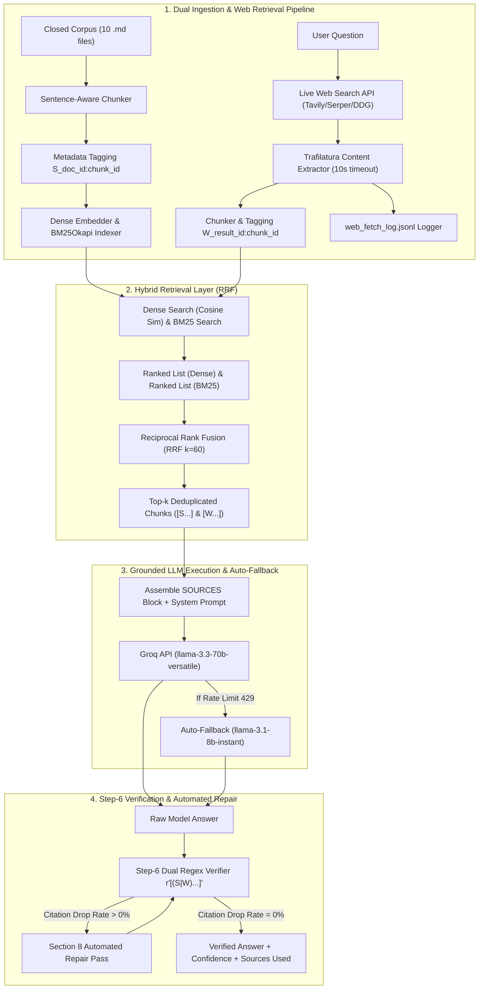

# 🔍 Verifiable Research Agent (with Inline Citations, Hybrid RRF & Live Web Search)

[](https://www.python.org/)
[](https://groq.com/)
[](https://streamlit.io/)
[]()
[]()
[](LICENSE)

An agentic research assistant that answers complex technical and financial questions using **ONLY** ingested source documents (closed corpus) and optional **live web search** results. Every factual claim is verifiably grounded with exact inline bracket citations (`[S<doc_id>:<chunk_id>]` for corpus, `[W<result_id>:<chunk_id>]` for web), backed by hybrid RRF retrieval, sentence-level regex post-verification, automated repair passes, and fetch logging.

---

## 🌟 Key Features

- 🎯 **Closed-Corpus & Live Web Grounding**: Supports `--source=corpus|web|both`. Answers questions strictly using provided sources with zero pretrained memory hallucination.
- 🌐 **Live Web Search & Trafilatura Extraction (`src/web_search.py`)**: Uses Tavily API (`TAVILY_API_KEY`), Serper API (`SERPER_API_KEY`), or DuckDuckGo Search. Fetches full page content with `requests` (10s timeout, 1 retry max) and extracts body text with `trafilatura`. Filters pages returning < 100 words.
- 📜 **Web Fetch Logging (`web_fetch_log.jsonl`)**: Logs every fetched URL with ISO timestamp, HTTP status code, word count, title, and error messages.
- 🔀 **Hybrid Retrieval (Dense + BM25Okapi RRF)**: Combines TF-IDF vector similarity with BM25 keyword search, merged via Reciprocal Rank Fusion ($score = \sum \frac{1}{60 + rank}$).
- 📌 **Dual Inline Citation Markers**: Attaches exact citation markers (`[S1:00]` for corpus, `[W1:00]` for web, stacked `[S1:02][W2:01]`) to every factual sentence.
- 🛡️ **Step-6 Dual Regex Post-Verification**: Computes sentence-level citation density and marker drop rates matching `r'\[(S|W)\d+:\d{2}(?::\d+)?\]'`.
- 🔧 **Section 8 Automated Repair Pass**: Detects uncited claims and automatically triggers a targeted repair re-prompt to achieve maximum citation coverage.
- 📊 **15-Question Evaluation Suite**: Comprehensive benchmark covering directly answerable, partially answerable, unanswerable, and conflicting cases.
- 🎨 **Interactive Streamlit Web UI**: High-contrast visual interface to select source modes (`Corpus`, `Web`, `Both`), retrieval modes (`Hybrid`, `Dense`, `BM25`), test queries, view similarity scores, and review evaluation transcripts.

---

## 🏗️ System Architecture



---

## 📁 Repository Structure

```text
research-agent/
├── sample_sources/            # Expanded 10 Source Documents
│   ├── doc1_company_q3_report.md
│   ├── doc2_market_analysis.md
│   ├── doc3_sustainability_policy.md
│   ├── doc4_security_whitepaper.md
│   ├── doc5_ai_governance_policy.md
│   ├── doc6_product_roadmap_2026.md
│   ├── doc7_legal_terms_of_service.md
│   ├── doc8_quarterly_audit_notes.md
│   ├── doc9_disaster_recovery_plan.md
│   └── doc10_competitor_landscape.md
├── src/                       # Core engine modules
│   ├── agent.py               # LLM execution, system prompt, and repair pass logic
│   ├── chunker.py             # Sentence-boundary chunker (300-500 words)
│   ├── embeddings.py          # Vector embedder & BM25Okapi Hybrid RRF retrieval
│   └── web_search.py          # Live web search, Trafilatura extraction & JSONL logger
├── config.py                  # Dual system prompt, repair template, and .env loader
├── ingest.py                  # Document ingestion & index generator CLI
├── ask.py                     # Research query CLI with --retrieval & --source=corpus|web|both flags
├── verify.py                  # Step-6 dual regex citation post-verifier
├── test_hybrid.py             # A/B retrieval benchmark test script
├── test_web_search.py         # Live web search unit test script
├── run_eval.py                # 15-question evaluation suite runner
├── app.py                     # Interactive Streamlit Web Application
├── web_fetch_log.jsonl        # Live web fetch audit log
├── questions.json             # Evaluation benchmark test set (15 questions)
├── eval_results.json          # Output evaluation transcript & metrics
├── submission_notes.md        # Technical approach report & trade-off notes
├── requirements.txt           # Pinned python dependencies
└── README.md                  # Project documentation
```

---

## 🚀 Quick Start Guide

### 1. Installation & Setup
```bash
git clone https://github.com/Zahid-coder-17/research-agent.git
cd research-agent
pip install -r requirements.txt
```

Create `.env` file:
```env
GROQ_API_KEY=your_groq_api_key_here
TAVILY_API_KEY=your_tavily_api_key_here  # Optional for Web Search
SERPER_API_KEY=your_serper_api_key_here  # Optional for Web Search
```

### 2. Ingest Source Corpus (10 Documents)
```bash
python ingest.py sample_sources/*
```

### 3. Query Agent via CLI (Corpus, Web, or Both)
```bash
# Closed Corpus Only
python ask.py "What post-quantum cryptography algorithms will Apex adopt by Q2 2026?" --source=corpus

# Live Web Search Only
python ask.py "What is the latest quantum computing milestone announced by IBM in 2026?" --source=web

# Both Corpus & Web Combined
python ask.py "Compare Apex Q3 revenue with current AWS Q3 market results" --source=both
```

### 4. Run Comprehensive Unit Test Suite
```bash
python run_tests.py
```

### 5. Run Live Web Search Unit Test
```bash
python test_web_search.py
```

### 6. Run 15-Question Evaluation Suite
```bash
python run_eval.py
```

### 7. Launch Visual Web UI
```bash
streamlit run app.py
```

---

## 📜 License

This project is licensed under the [MIT License](LICENSE).
